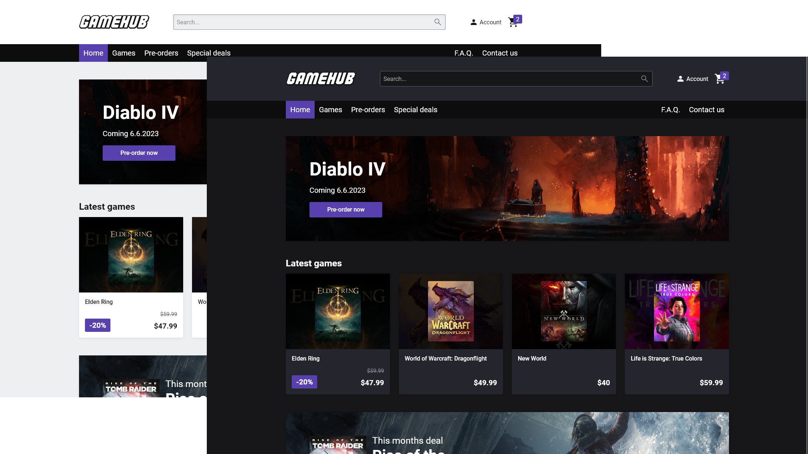

# GameHub



A cross course school project for an online games store where the user could buy new, used games as well as pre-ordering upcoming games. In addition to this the user was also able to sell their bought games on the site.

[See live site](https://gamehub-v2.netlify.app/)

## Description

This site was made for a fictional company named GameHub. They wanted a site where users could buy a huge range of games, and also sell their used games.

The target audience for this site was people aged 18 to 25 who are interested in computer games, and would either like to purchase games or would like to sell games they have finished playing.

## Built With

- HTML
- CSS
- JavaScript
- Wordpress CMS

## Getting Started

### Installing

1. Clone the repo:

```bash
git clone git@github.com:Noroff-FEU-Assignments/cross-course-project-martekn.git
```

## Contributing

If you have any feedback or suggestions to make the project better, please fork the repo and create a pull request.

## Contact

You can contact me on [linkedIn](https://www.linkedin.com/in/martekn/) or send an email to marte.mk@hotmail.com
